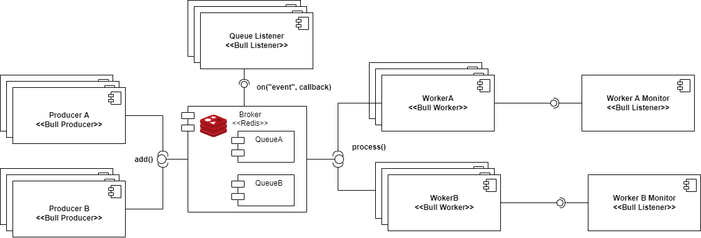

# Task-Worker Architecture using Bull

This repository is a simple task-worker architecture implementation in node using the [Bull](https://github.com/OptimalBits/bull) library, including:
- Producers
- Workers
- Listeners

All the components of the system are dockerized, so every component can be scaled to hold a higher throughput of work.

# How to run

## One container of each service
```
docker compose up -d
```
## Scaling the number of workers
```
docker compose up -d --scale worker={number_of_workers}
```

## Documentation:
- [Bull docs](https://github.com/OptimalBits/bull/tree/develop/docs)

The architecture of the project is the following

